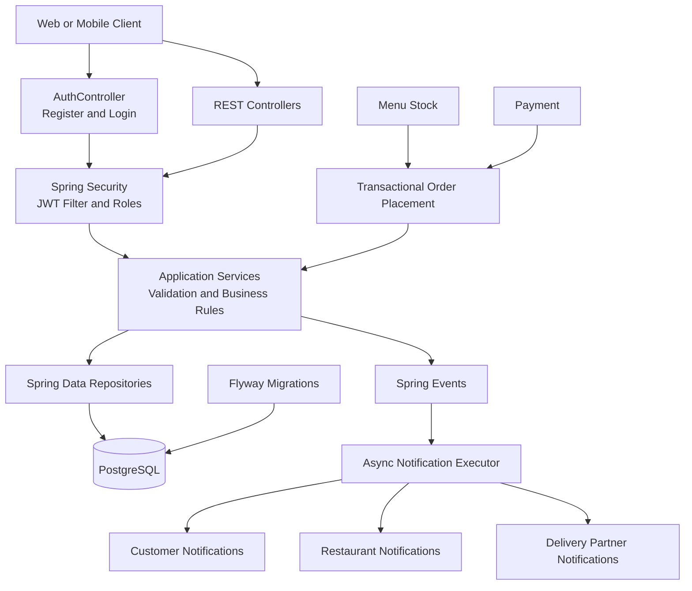

# Food Delivery Order Management System

Spring Boot backend for a food delivery order management system, built incrementally.

## Technology

- Java 21 and Spring Boot 3.x
- Gradle Wrapper, Spring Web, Spring Data JPA, Hibernate
- PostgreSQL and Flyway
- Spring Security and JWT dependencies (security implementation pending)
- Jakarta Validation, Lombok, JUnit 5, Mockito
- Swagger / OpenAPI

## Package structure

```text
com.fooddelivery
├── config       # Framework configuration
├── controller   # HTTP endpoints (future iterations)
├── dto          # Request and response DTOs (future iterations)
├── entity       # JPA entities (future iterations)
├── exception    # Global error handling
├── mapper       # DTO mappers (future iterations)
├── repository   # Persistence access (future iterations)
├── security     # JWT components (future iterations)
└── service      # Business logic (future iterations)
```

## Configuration

The default datasource points to a local PostgreSQL database named `food_delivery`.
Override it with `DB_HOST`, `DB_PORT`, `DB_NAME`, `DB_USERNAME`, and `DB_PASSWORD`.

For local development, export these variables before starting the application:

```bash
export DB_HOST=localhost
export DB_PORT=5432
export DB_NAME=food_delivery
export DB_USERNAME=postgres
export DB_PASSWORD=postgres
export JWT_SECRET=VGhpc0lzQVN1ZmZpY2llbnRseUxvbmdTZWNyZXRLZXlGb3JEZXZlbG9wbWVudA==
export JWT_EXPIRATION_MILLIS=3600000
```

`JWT_SECRET` must be a Base64-encoded secret suitable for HMAC signing. Use a different secret outside local development.

Flyway migrations belong in `src/main/resources/db/migration` and Hibernate validates the schema; it does not generate it.

## Run

```bash
./gradlew bootRun
```

## API documentation

After starting the application, Swagger UI is available at `/swagger-ui.html` and the OpenAPI document at `/v3/api-docs`.

## Creating a user locally

Public registration creates a `CUSTOMER` account:

```bash
curl -X POST http://localhost:8080/api/auth/register \
  -H 'Content-Type: application/json' \
  -d '{
    "firstName": "Asha",
    "lastName": "Sharma",
    "email": "asha@example.com",
    "password": "password123"
  }'
```

Log in to receive a JWT:

```bash
curl -X POST http://localhost:8080/api/auth/login \
  -H 'Content-Type: application/json' \
  -d '{"email":"asha@example.com","password":"password123"}'
```

Use the returned `accessToken` as `Authorization: Bearer <token>` for protected endpoints. Admin, restaurant-owner, and delivery-partner accounts should be provisioned through an appropriately authorized administrative workflow; public registration intentionally cannot choose an elevated role.

## Architecture


